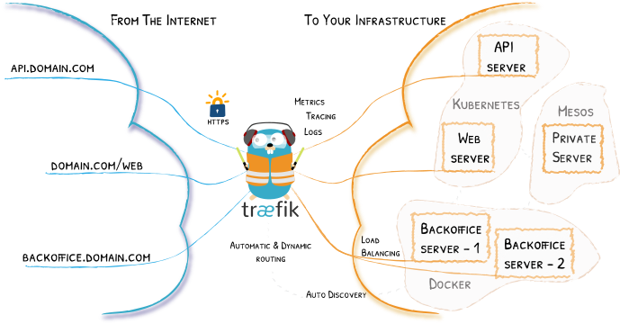

##  for Kubernetes

[Traefik](https://traefik.io/) is a modern HTTP reverse proxy and load balancer that makes deploying microservices easy. Traefik integrates with your existing infrastructure components (Docker, Swarm mode, Kubernetes, Marathon, Consul, Etcd, Rancher, Amazon ECS, ...) and configures itself automatically and dynamically. Pointing Traefik at your orchestrator should be the only configuration step you need. 



> Read more about Traefik from its [documentation](https://docs.traefik.io/)

### Features of Traefik

1. Auto Discovery (Kubernetes, Mesos, Docker Swarm, Marathon, Rancher, ...)
2. Tracing (Open Tracing, Jaeger & Zipkin)
3. Metrics (Prometheus, Data Dog, StatsD, InfluxDB, ...)
4. HTTPS (Let's Encrypt, ACME, custom certificates, ...)
5. And Many more...

### Implementation

This repo contains the implementation of Traefik with Kubernetes. To read more about implementation of Traefik, Read this [User Guide](https://docs.traefik.io/user-guide/kubernetes/)

#### Some features implemented in this repo

1. [Basic Authentication](https://docs.traefik.io/user-guide/kubernetes/#basic-authentication)

    Implemented Basic Authentication to protect access to Traefik.

2. [Multiple Traefik Deployment](https://docs.traefik.io/user-guide/kubernetes/#between-multiple-traefik-deployments)

    To implement multiple traefik, we need to define class to traefik deployment and set `kubernetes.io/ingress.class` annotation to the respective ingress resource.

3. [Multiple Ingress Definitions for the Same Host](https://docs.traefik.io/user-guide/kubernetes/#multiple-ingress-definitions-for-the-same-host-or-hostpath)

    Traefik will merge multiple Ingress definitions for the same host/path pair into one definition.

4. [Traffic Splitting](https://docs.traefik.io/user-guide/kubernetes/#traffic-splitting)

    It is possible to split Ingress traffic in a fine-grained manner between multiple deployments using service weights.

5. [CircuitBreaker](https://docs.traefik.io/v2.0/middlewares/circuitbreaker/)

    Traefik comes with many different available middlewares, some can modify the request, the headers, some are in charge of redirections, some add authentication, and so on.

    

    The circuit breaker protects your system from stacking requests to unhealthy services (resulting in cascading failures).

    When your system is healthy, the circuit is close (normal operations). When your system becomes unhealthy, the circuit becomes open and the requests are no longer forwarded (but handled by a fallback mechanism).

    To assess if your system is healthy, the circuit breaker constantly monitors the services.

#### Testing

Run below command to setup this experiment.

```shell
./setup.sh apply
```

1. Traefik Web UI will be served at [http://k8s.local](http://k8s.local) and [http://kube.local](http://k8s.local).
2. [http://k8s.local/status/200](http://k8s.local/status/200) will send HTTP 200 response page.
3. [http://k8s.local/status/500](http://k8s.local/status/500) will send HTTP 500 response page.
4. [http://k8s.local/abc](http://k8s.local/abc) will serve helloworld page along with some pod info.

#### Implementing CircuitBreaker

1.  To implement circuitBreaker in Kubernetes, we need to set `traefik.ingress.kubernetes.io/circuit-breaker-expression` annotation to the corresponding service.

2.  The expression can check three different metrics:

    * The network error ratio (NetworkErrorRatio)
    * The status code ratio (ResponseCodeRatio)
    * The latency at quantile, in milliseconds (LatencyAtQuantileMS)

3. States in CircuitBreaker:
    * Close (your service operates normally)
        
        While Close, At specified intervals (`checkPeriod`), it will evaluate expression to decide if its state must change.

    * Open (the fallback mechanism takes over your service)

        While open, the fallback mechanism takes over the normal service calls for a duration of FallbackDuration. After this duration, it will enter the recovering state.

    * Recovering (the circuit breaker tries to resume normal operations by progressively sending requests to your service)

        While recovering, the circuit breaker will progressively send requests to your service again (in a linear way, for RecoveryDuration). If your service fails during recovery, the circuit breaker becomes open again. If the service operates normally during the whole recovering duration, then the circuit breaker returns to close.
    
4. Fallback mechanism:

    The fallback mechanism returns a HTTP 503 Service Unavailable to the client (instead of calling the target service). **This behavior cannot be configured**.

    * CheckPeriod

        The interval used to evaluate expression and decide if the state of the circuit breaker must change. By default, CheckPeriod is **100Ms**. **This value cannot be configured**.

    * FallbackDuration

        By default, FallbackDuration is **10 seconds**. **This value cannot be configured**.

    * RecoveringDuration

        The duration of the recovering mode (recovering state).
        By default, RecoveringDuration is **10 seconds**. **This value cannot be configured**.

#### Conclusion

* Traefik CircuitBreaker protects system from stacking requests to unhealthy service (It might be possible that few pods are unhealthy and the remaining pods are healthy which can also stop our application to serve the requests from healthy pods for atleast **10 seconds** as the rule defined is same).

* It is recommended to use LoadBalancing (**Dynamic Round Robin**: increases weights on servers that perform better than others. It also rolls back to original weights if the servers have changed.) along with Traefik CircuitBreaker, so the pods which are unhealthy, will get less weightage as compared to healthy pods and healthy pods can serve maximum requests.